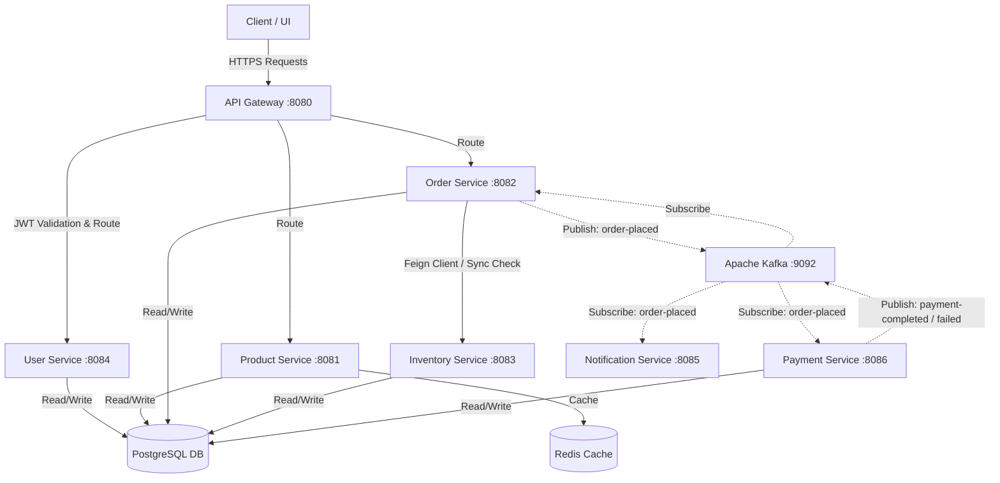
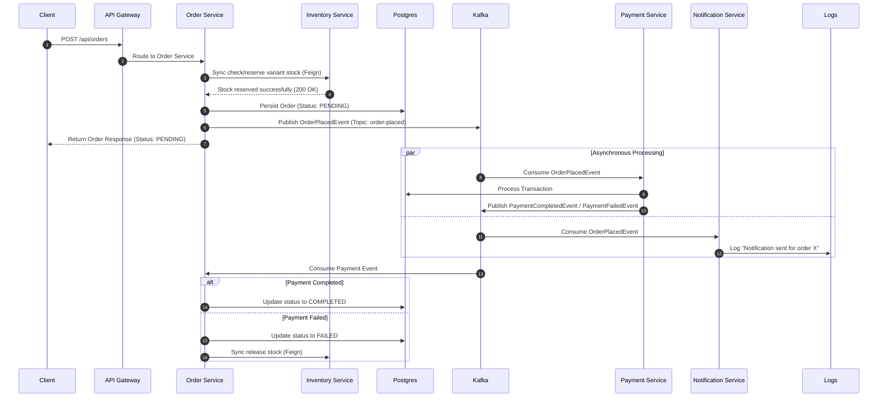

# Distributed E-Commerce Microservices Stack

A production-grade, event-driven e-commerce platform built using **Spring Boot 3.x**, **Spring Cloud**, **Apache Kafka**, **PostgreSQL**, **Redis**, and containerized for orchestration on a **Kubernetes cluster**.

---

## 1. Architectural Topology

The system is designed with a decentralized, event-driven architecture to maximize scalability, resilience, and loose coupling.



### Key Architectural Patterns

- **API Gateway Pattern**: Single entry point for all clients. Handles path routing, load balancing, and centralized JWT security validation.
- **Database per Service**: Microservices do not share database schemas to enforce domain boundaries. Postgres schemas are isolated per service (e.g., `userdb`, `productdb`, `orderdb`, `inventorydb`, `paymentdb`).
- **Synchronous Orchestration (Feign)**: The `Order Service` makes synchronous, blocking Feign calls to the `Inventory Service` to verify and reserve variant stock before finalizing an order request.
- **Asynchronous Choreography (Kafka)**: Post-order processes (Payments, Email/SMS notifications) are triggered asynchronously using event propagation over Kafka topics to decouple system dependencies.

---

## 2. Microservice Registry & Ports

| Service Directory       | Spring Boot Service    | Container Port | Kubernetes Internal Service URL    | Description                                     |
| :---------------------- | :--------------------- | :------------- | :--------------------------------- | :---------------------------------------------- |
| `/api-gateway`          | `api-gateway`          | `8080`         | `http://api-gateway:8080`          | Edge proxy, JWT validator & router              |
| `/user-service`         | `user-service`         | `8084`         | `http://user-service:8084`         | User accounts, profiles & auth token generation |
| `/product_service`      | `product-service`      | `8081`         | `http://product-service:8081`      | Product catalog, attributes & variant options   |
| `/order-service`        | `order-service`        | `8082`         | `http://order-service:8082`        | Order management & transaction orchestrator     |
| `/inventory-service`    | `inventory-service`    | `8083`         | `http://inventory-service:8083`    | Variant-level stock reservation & controls      |
| `/payment_service`      | `payment-service`      | `8086`         | `http://payment-service:8086`      | Event-driven transaction settlement processor   |
| `/notification-service` | `notification-service` | `8085`         | `http://notification-service:8085` | Event-driven consumer for notifications         |

## 3. End-to-End Saga & Event Flows

The checkout flow follows an event-driven choreography pattern:



---

## 4. Centralized Security Model

1. **Token Retrieval**: A user submits credentials to `POST /api/auth/login`. The `User Service` validates credentials and returns a signed HS256 JWT containing user details.
2. **Access Control**: For subsequent requests, the Client includes the `Authorization: Bearer <TOKEN>` header.
3. **Gateway Enforcement**: The `API Gateway` intercepts requests through a custom `JwtAuthenticationFilterFactory`. It decrypts, parses, and validates the signature of the JWT using a shared secret key. If valid, the gateway routes the request; otherwise, it returns `401 Unauthorized` without letting the request reach downstream services.

---

## 5. Local & Kubernetes Deployment

### Local Development (Docker Compose)

To run the infrastructure containers (PostgreSQL, Redis, Kafka) locally:

```bash
docker-compose -f docker-compose.infra.yml up -d
```

To build and start the entire stack including services:

```bash
docker-compose up --build
```

### Production Deployment (Kubernetes Helm Chart)

The entire application stack is packaged as a Helm Chart under `/ecomm-chart`.

1. Ensure the namespace exists:
   ```bash
   kubectl create namespace ecomm
   ```
2. Deploy the chart from the root directory:
   ```bash
   helm upgrade --install ecomm ./ecomm-chart -n ecomm
   ```
3. Expose the API Gateway port to access the API:
   ```bash
   kubectl port-forward service/api-gateway -n ecomm 9000:8080 --address 0.0.0.0 &
   ```
4. Access endpoints via the gateway proxy.
