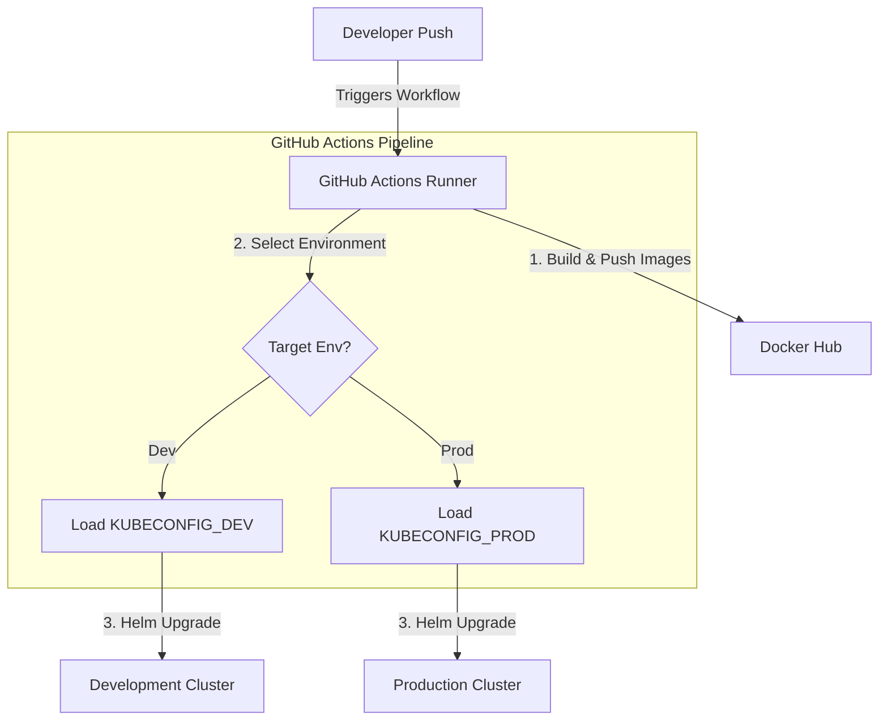

# Guide: Building a Generic CI/CD Pipeline for Any Kubernetes Cluster

To deploy your microservices to **any** target Kubernetes cluster dynamically, the pipeline needs two things:
1. **Authentication (Kubeconfig):** The credentials to connect to the API server of the target cluster.
2. **Configuration (Helm Values):** Environment-specific values (e.g., domain names, database sizes, or replica counts) for that specific cluster.

By combining **GitHub Actions** and **Helm**, we can build a pipeline where you choose the target environment (e.g., `dev`, `staging`, or `prod`), and it dynamically selects the correct credentials and deploys the system.

---

## The Workflow Architecture



---

## Step 1: Manage Environment-Specific Values (Helm)

Inside your `ecomm-chart` directory, you can create separate values files for each environment instead of editing the default `values.yaml` directly.

For example:
* **`values-dev.yaml`** (for staging/dev clusters with low resource limits and 1 replica):
  ```yaml
  global:
    image:
      tag: "dev-latest"
  postgres:
    resources:
      limits: { memory: "256Mi", cpu: "200m" }
  microservices:
    resources:
      limits: { memory: "256Mi", cpu: "200m" }
  ```
* **`values-prod.yaml`** (for production clusters with high availability, database replication, and higher CPU/RAM limits):
  ```yaml
  global:
    image:
      tag: "stable"
  postgres:
    resources:
      limits: { memory: "1Gi", cpu: "1000m" }
  microservices:
    resources:
      limits: { memory: "512Mi", cpu: "500m" }
  ```

---

## Step 2: Configure GitHub Secrets

For the pipeline to talk to your clusters, you need to save the contents of their `kubeconfig` files in your GitHub repository secrets.

1. Go to your GitHub repository -> **Settings** -> **Secrets and variables** -> **Actions**.
2. Create the following secrets:
   * `DOCKERHUB_USERNAME`: Your Docker Hub username.
   * `DOCKERHUB_TOKEN`: Your Docker Hub personal access token.
   * `KUBECONFIG_DEV`: The entire text contents of the `kubeconfig` file for your Dev cluster.
   * `KUBECONFIG_PROD`: The entire text contents of the `kubeconfig` file for your Prod cluster.

---

## Step 3: The Multi-Cluster GitHub Actions Workflow

Create a file named `.github/workflows/deploy.yml` in your project root. Here is the fully generic, production-ready workflow:

```yaml
name: CI/CD Multi-Cluster Deployer

on:
  push:
    branches:
      - main
  # Allows you to trigger the deployment manually and select the cluster
  workflow_dispatch:
    inputs:
      environment:
        description: 'Target Environment'
        required: true
        default: 'dev'
        type: choice
        options:
          - dev
          - prod

env:
  DOCKER_USER: "sarthak247" # Replace with your Docker Hub user

jobs:
  # Job 1: Compile code and build/push Docker Images
  build-and-push:
    runs-on: ubuntu-latest
    strategy:
      matrix:
        service: [api-gateway, product_service, order-service, inventory-service, user-service, notification-service, payment_service]
    
    steps:
      - name: Checkout Code
        uses: actions/checkout@v4

      - name: Set up JDK 21
        uses: actions/setup-java@v4
        with:
          java-version: '21'
          distribution: 'temurin'
          cache: 'maven'

      - name: Compile and Package Jars
        run: |
          cd ${{ matrix.service }}
          mvn clean package -DskipTests

      - name: Log in to Docker Hub
        uses: docker/login-action@v3
        with:
          username: ${{ env.DOCKER_USER }}
          password: ${{ secrets.DOCKERHUB_TOKEN }}

      - name: Set up Docker Buildx
        uses: docker/setup-buildx-action@v3

      - name: Build and Push Docker Image
        uses: docker/build-push-action@v5
        with:
          context: ./${{ matrix.service }}
          push: true
          # Tags the image with the git commit SHA as well as 'latest'
          tags: |
            ${{ env.DOCKER_USER }}/ecomm-${{ matrix.service }}:latest
            ${{ env.DOCKER_USER }}/ecomm-${{ matrix.service }}:${{ github.sha }}
          cache-from: type=gha
          cache-to: type=gha,mode=max

  # Job 2: Deploy to the selected Kubernetes Cluster
  deploy:
    needs: build-and-push
    runs-on: ubuntu-latest
    steps:
      - name: Checkout Code
        uses: actions/checkout@v4

      - name: Install Helm
        uses: azure/setup-helm@v4

      - name: Set Target Environment
        run: |
          # If triggered manually, use the selected input. If triggered by push, default to 'dev'.
          if [ "${{ github.event_name }}" = "workflow_dispatch" ]; then
            echo "TARGET_ENV=${{ github.event.inputs.environment }}" >> $GITHUB_ENV
          else
            echo "TARGET_ENV=dev" >> $GITHUB_ENV
          fi

      - name: Configure Kubectl Credentials (Kubeconfig)
        run: |
          mkdir -p ~/.kube
          if [ "${{ env.TARGET_ENV }}" = "prod" ]; then
            echo "${{ secrets.KUBECONFIG_PROD }}" > ~/.kube/config
          else
            echo "${{ secrets.KUBECONFIG_DEV }}" > ~/.kube/config
          fi
          chmod 600 ~/.kube/config

      - name: Test Connection to Target Cluster
        run: |
          kubectl cluster-info
          kubectl get nodes

      - name: Deploy Stack using Helm
        run: |
          # Checks if values file exists for selected env, uses default values.yaml if not.
          VALUES_FILE="ecomm-chart/values-${{ env.TARGET_ENV }}.yaml"
          
          if [ -f "$VALUES_FILE" ]; then
            echo "Deploying with environment values: $VALUES_FILE"
            helm upgrade --install ecomm ./ecomm-chart \
              --namespace ecomm \
              --create-namespace \
              --values $VALUES_FILE \
              --set global.image.repositoryPrefix=${{ env.DOCKER_USER }} \
              --set global.image.tag=${{ github.sha }}
          else
            echo "Deploying with default values.yaml"
            helm upgrade --install ecomm ./ecomm-chart \
              --namespace ecomm \
              --create-namespace \
              --set global.image.repositoryPrefix=${{ env.DOCKER_USER }} \
              --set global.image.tag=${{ github.sha }}
          fi
```

---

## Why This Pipeline is Highly Adaptable:

1. **GitHub Runner Cache Optimization:**
   The workflow caches the Maven `.m2` repository and Docker build layers (`cache-from/to: type=gha`). This drops subsequent build times from 10+ minutes to less than 2 minutes.
2. **Environment Isolation:**
   It uses `--values ecomm-chart/values-dev.yaml` dynamically. When running in dev, it deploys a cheap developer cluster. In production, it loads production configs automatically.
3. **Rollout Version Control:**
   Instead of using the unstable `:latest` tag in Kubernetes (which can cause mismatching images), the pipeline labels images with the unique git commit SHA (`${{ github.sha }}`) and triggers Helm to deploy that exact version. If a bug is deployed, you can roll back instantly to a previous commit.
