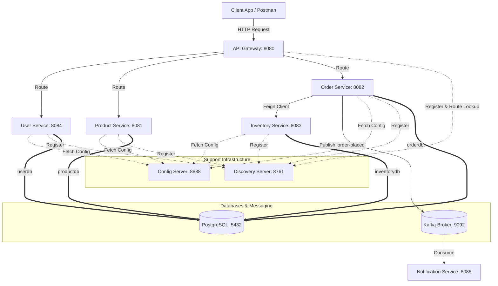
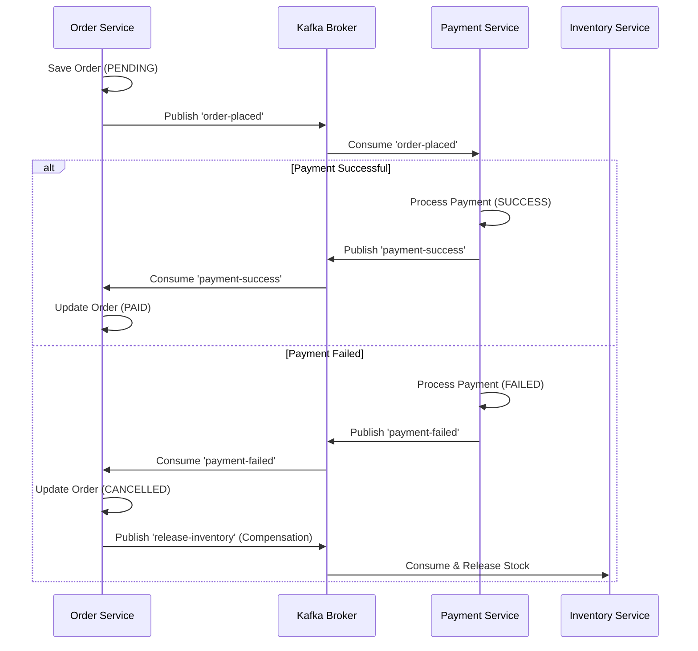

# E-Commerce Microservices System Implementation Plan

This document outlines a step-by-step roadmap to complete your e-commerce microservice system. Building microservices can feel overwhelming because of the moving parts (service discovery, config servers, API gateways, database segregation, and async messaging). This plan breaks the work down into manageable phases, each with a clear focus, to help you overcome procrastination and build momentum.

---

## 1. System Architecture Overview

Here is the blueprint of the system you are building:



### Current Status Audit
- **Infrastructure**: Docker Compose (`docker-compose.yml`, `docker-compose.infra.yml`, `init-db/init.sql`) is well-structured.
- **Config & Discovery**: `config-server` and `discovery-server` are set up.
- **Product Service**: Fully modeled with REST endpoints (`ProductController` is complete).
- **User Service**: Has security configuration, JWT utilities, and `AuthController` (needs minor fixes).
- **Inventory, Order, Notification Services**: Boilerplate only.
- **API Gateway**: Boilerplate only; routing is configured in properties, but lacks dependencies and JWT security.

---

## Phase 1: Fix and Align Existing Services
*Goal: Ensure the core foundations (Discovery, Configuration, Auth, and Catalog) compile, register, and talk to each other correctly.*

### Task 1.1: Fix the `user-service` POM Copy-Paste Error
- Update `user-service/pom.xml` to use:
  ```xml
  <artifactId>user-service</artifactId>
  <name>user-service</name>
  ```

### Task 1.2: Add Service Discovery Clients
Currently, `product-service` and `user-service` have config clients, but are missing the Eureka Discovery Client dependency.
- In both `product_service/pom.xml` and `user-service/pom.xml`, add the following dependency:
  ```xml
  <dependency>
      <groupId>org.springframework.cloud</groupId>
      <artifactId>spring-cloud-starter-netflix-eureka-client</artifactId>
  </dependency>
  ```

### Task 1.3: Convert `AuthController` to `@RestController`
- Change the annotation in `AuthController.java` to `@RestController` (instead of `@Controller`).
- Add `@RequestBody` and `@Valid` to the parameters of the `register` and `login` methods to properly parse JSON requests.

---

## Phase 2: Build the Inventory Service
*Goal: Create a standalone service to manage stock levels for product variants.*

### Task 2.1: Configure Dependency Management and Properties
- Update `inventory-service/pom.xml` to include `spring-cloud-starter-config`, `spring-cloud-starter-netflix-eureka-client`, `spring-boot-starter-data-jpa`, and the `postgresql` driver. Copy the `<dependencyManagement>` block from `product-service/pom.xml`.
- Ensure `inventory-service` points to the Config Server in its `bootstrap.yml` or `application.properties`.

### Task 2.2: Create the Entity and Database Table
- Create an `Inventory` entity:
  ```java
  @Entity
  @Table(name = "inventory")
  public class Inventory {
      @Id
      @GeneratedValue(strategy = GenerationType.UUID)
      private UUID id;
      private UUID variantId; // Links to Product Variant
      private Integer quantity;
  }
  ```
- Write an `InventoryRepository` interface with:
  - `Optional<Inventory> findByVariantId(UUID variantId);`
  - `List<Inventory> findByVariantIdIn(List<UUID> variantIds);`

### Task 2.3: Implement the Controller and Service
- Implement REST endpoints:
  - `GET /api/inventory/check?variantId=xxx&quantity=yyy` (returns boolean)
  - `POST /api/inventory/reduce` (reduces stock for list of order items; throws exception if insufficient)
  - `POST /api/inventory` (to add or restock inventory items)

---

## Phase 3: Build the Order Service
*Goal: Orchestrate placing an order, checking/reducing stock, and publishing events.*

### Task 3.1: Configure Dependencies
- Update `order-service/pom.xml` to include:
  - JPA, PostgreSQL, Eureka Client, Config Client, Web (or Webflux)
  - **Spring Cloud OpenFeign** (for synchronous HTTP calls to Inventory Service)
  - **Resilience4j** (for fallback / circuit breaker handling when calling Inventory)
  - **Spring Kafka** (to publish order events)

### Task 3.2: Create Order Entities
- Create `Order` and `OrderItem` entities:
  - `Order` contains `id`, `customerId`, `orderStatus`, `totalPrice`, `createdAt`, and a `@OneToMany` relationship to `OrderItem`.
  - `OrderItem` contains `id`, `variantId`, `quantity`, and `price`.

### Task 3.3: Implement OpenFeign Client for Inventory Service
- Create an interface annotated with `@FeignClient(name = "inventory-service")` to call:
  - `GET /api/inventory/check`
  - `POST /api/inventory/reduce`

### Task 3.4: Write Order Placement Logic with Circuit Breaker
- In `OrderService`:
  - Fetch user context (passed down from Gateway/Headers).
  - Verify variant availability via the Feign Client. Wrap this block in a `@CircuitBreaker(name = "inventoryService", fallbackMethod = "placeOrderFallback")`.
  - Save the order as `PENDING` or `COMPLETED`.
  - Trigger stock reduction via Feign.
  - Publish an `OrderPlacedEvent` message containing `orderId`, `customerId`, and `totalPrice` to Kafka.

---

## Phase 4: Build the Notification Service
*Goal: Listen to Kafka events and simulate notifications.*

### Task 4.1: Configure Dependencies
- Update `notification-service/pom.xml` to include `spring-kafka`, `spring-cloud-starter-netflix-eureka-client`, and Web dependencies.

### Task 4.2: Write the Kafka Listener
- Create a listener class:
  ```java
  @Service
  @Slf4j
  public class NotificationService {
      @KafkaListener(topics = "order-placed", groupId = "notification-group")
      public void handleOrderPlaced(OrderPlacedEvent event) {
          log.info("Notification sent for Order ID: {} to Customer: {}", event.getOrderId(), event.getCustomerId());
      }
  }
  ```

---

## Phase 5: Secure and Configure the API Gateway
*Goal: Route requests and protect private endpoints (like order placing).*

### Task 5.1: Set up Gateway POM
- Replace `spring-boot-starter-web` with `spring-cloud-starter-gateway` and add `spring-cloud-starter-netflix-eureka-client` to `api-gateway/pom.xml`. Note: Do not mix starter-web and starter-gateway in the same pom, as they use conflicting servlet/reactive engines.

### Task 5.2: Create a Custom JWT Validation Filter
- Create a `GatewayFilter` that intercepts requests to secured endpoints (e.g., `/api/orders/**`).
- Extract the `Authorization` Header, parse the JWT, and validate it using the same secret key as `user-service`.
- Inject the validated `customerId` or `username` into the request headers:
  ```java
  exchange.getRequest().mutate().header("X-User-Id", userId).build();
  ```

### Task 5.3: Update Gateway Routing Configurations
- Update `api-gateway.properties` (in the `./config` folder) to route:
  - `/api/auth/**` -> `USER-SERVICE`
  - `/api/products/**` -> `PRODUCT-SERVICE`
  - `/api/orders/**` -> `ORDER-SERVICE` (secured by JWT filter)

---

## Phase 6: Run, Test, and Verify
*Goal: Spin up the environment, run a full flow, and watch the microservices cooperate.*

1. **Start Infrastructure**: Run `docker-compose -f docker-compose.infra.yml up -d`.
2. **Start Registry & Config**: Boot up `discovery-server` and `config-server`.
3. **Start Services**: Boot up `user-service`, `product-service`, `inventory-service`, `order-service`, `notification-service`, and `api-gateway`.
4. **End-to-End Test Plan**:
   - **Step 1**: Register a user via `POST /api/auth/register` (through API Gateway). Receive JWT.
   - **Step 2**: Create a product and a variant via `POST /api/products` (through API Gateway).
   - **Step 3**: Stock the inventory for that variant via `POST /api/inventory`.
   - **Step 4**: Place an order via `POST /api/orders` passing the JWT in the `Authorization: Bearer <token>` header.
   - **Step 5**: Observe the console logs of `notification-service` to verify that the Kafka event was successfully consumed.

---

## Phase 7: Build the Payment Service (Event-Driven Saga Pattern)
*Goal: Process payments asynchronously when an order is placed and update order states dynamically based on success or failure (choreography-based saga).*



### Task 7.1: Bootstrap the Service & Configuration
- Create a new folder `payment-service` inside the root workspace.
- Set up a standard Spring Boot parent `pom.xml` with:
  - `spring-boot-starter-web` (for actuator/REST health checks)
  - `spring-boot-starter-data-jpa` and `postgresql` (to record transaction history)
  - `spring-cloud-starter-config` and `spring-cloud-starter-netflix-eureka-client`
  - `spring-kafka`
- Create `payment-service/src/main/resources/application.properties` pointing to the config server.
- Add configuration profiles `config/payment-service.properties` (server port `8086`, db connection to `paymentdb`, and Eureka client settings) and commit them to the git repository.

### Task 7.2: Create the Database Entity
- Create a `Payment` entity:
  ```java
  @Entity
  @Table(name = "payments")
  public class Payment {
      @Id
      @GeneratedValue(strategy = GenerationType.UUID)
      private UUID id;
      private UUID orderId;
      private UUID customerId;
      private BigDecimal amount;
      private String paymentStatus; // SUCCESS, FAILED
      private String transactionId;
      private LocalDateTime createdAt;
  }
  ```
- Implement a corresponding `PaymentRepository`.

### Task 7.3: Implement the Kafka Consumer (`order-placed`)
- Create a consumer service that listens to the `order-placed` Kafka topic.
- Parse the event payload containing the order details (`orderId`, `customerId`, `totalPrice`).
- Implement the payment simulation logic:
  - Mock processing the charge. (e.g., if the customer ID or order ID is invalid, or if the amount is less than 0, fail the payment; otherwise, mark as successful).
  - Save the transaction details to the database with a random UUID for the `transactionId`.

### Task 7.4: Publish Payment Outcomes to Kafka
- If payment succeeds: Publish a `PaymentSuccessfulEvent` containing `orderId` and `paymentId` to topic `payment-success`.
- If payment fails: Publish a `PaymentFailedEvent` containing `orderId` and `reason` to topic `payment-failed`.

### Task 7.5: Update Order Service to Handle Payment Success/Failure
- In `order-service`, add a Kafka consumer listening to the `payment-success` and `payment-failed` topics.
- **On Payment Success**:
  - Load the order from the database and set its status to `COMPLETED` or `PAID`.
- **On Payment Failure**:
  - Load the order from the database and set its status to `CANCELLED`.
  - Trigger a compensation action: Call the `InventoryClient` to release the reserved stock (or publish a stock release event to Kafka).

