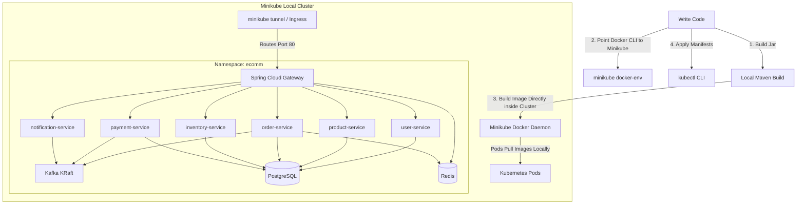

# Guide: Deploying Microservices Locally Using Minikube

Deploying your microservices stack locally on **Minikube** is the easiest way to learn, test, and debug. 

This approach removes the complexity of managing cloud accounts (AWS/Oracle), setting up SSH keys, and paying for infrastructure. Since Minikube runs on your local machine, we can utilize a fantastic trick: **pointing your local Docker CLI to Minikube's internal Docker daemon**. This lets you build images locally and run them inside Kubernetes instantly without pushing them to Docker Hub!

---

## Local Architecture Flow



---

## Table of Contents
1. [Prerequisites & Resource Requirements](#prerequisites--resource-requirements)
2. [Step 1: Installing Minikube & Kubectl on Windows](#step-1-installing-minikube--kubectl-on-windows)
3. [Step 2: Starting Minikube with Optimized Resources](#step-2-starting-minikube-with-optimized-resources)
4. [Step 3: The Docker Trick (Bypass Docker Hub)](#step-3-the-docker-trick-bypass-docker-hub)
5. [Step 4: Building your Microservice Images Locally](#step-4-building-your-microservice-images-locally)
6. [Step 5: Creating Namespace & ConfigMaps](#step-5-creating-namespace--configmaps)
7. [Step 6: Deploying Local Infrastructure (Postgres, Redis, Kafka)](#step-6-deploying-local-infrastructure-postgres-redis-kafka)
8. [Step 7: Deploying the Microservices & Gateway](#step-7-deploying the-microservices--gateway)
9. [Step 8: Accessing your App via Ingress & Minikube Tunnel](#step-8-accessing-your-app-via-ingress--minikube-tunnel)
10. [Step 9: Setting up Prometheus & Grafana Observability](#step-9-setting-up-prometheus--grafana-observability)

---

## Prerequisites & Resource Requirements

To run this entire stack locally, your computer should ideally have:
* **RAM:** At least **16 GB of physical RAM** (so you can allocate 8 GB to Minikube and leave 8 GB for Windows/VS Code).
* **CPU:** At least a quad-core CPU (so you can allocate 4 CPUs to Minikube).
* **Hypervisor:** Docker Desktop installed and running.

---

## Step 1: Installing Minikube & Kubectl on Windows

### 1.1 Install Docker Desktop
Make sure you have **Docker Desktop** installed and running on Windows. (Minikube uses Docker as its driver by default). Download it from [docker.com](https://www.docker.com/products/docker-desktop/).

### 1.2 Install Minikube
1. Open PowerShell as Administrator.
2. Install Minikube using Windows Package Manager (Winget):
   ```powershell
   winget install Kubernetes.minikube
   ```
3. Restart your PowerShell/Terminal so the path updates.

### 1.3 Install Kubectl
Install `kubectl` using Winget:
```powershell
winget install Kubernetes.kubectl
```

---

## Step 2: Starting Minikube with Optimized Resources

Start Minikube and allocate **8 GB of RAM** and **4 CPUs** to the cluster:

```powershell
# Start Minikube using Docker driver
minikube start --driver=docker --cpus=4 --memory=8192
```

Verify that the cluster is running:
```powershell
kubectl get nodes
```
*(You should see `minikube` listed as the control-plane node).*

---

## Step 3: The Docker Trick (Bypass Docker Hub)

Usually, to deploy an image to Kubernetes, you have to build it, push it to Docker Hub, and Kubernetes pulls it down. For local development, this is very slow.

Instead, we can configure our local terminal so that any `docker build` command builds the image directly **inside Minikube's internal Docker registry**.

Run this command in your PowerShell window:
```powershell
& minikube -p minikube docker-env | Invoke-Expression
```
*(If you are using Git Bash on Windows, run `eval $(minikube -p minikube docker-env)`).*

> [!IMPORTANT]
> This command only configures your **current terminal session**. If you open a new terminal window, you must run this command again before building images.

---

## Step 4: Building your Microservice Images Locally

Now that your terminal is pointed to Minikube's Docker daemon, build the images for all your microservices:

1. Open your terminal at the root of `ecomm-microservice`.
2. Run the Maven builds to package your JAR files:
   ```bash
   mvn clean package -DskipTests
   ```
3. Build the Docker images:
   ```bash
   docker build -t ecomm-api-gateway:latest ./api-gateway
   docker build -t ecomm-product-service:latest ./product_service
   docker build -t ecomm-order-service:latest ./order-service
   docker build -t ecomm-inventory-service:latest ./inventory-service
   docker build -t ecomm-user-service:latest ./user-service
   docker build -t ecomm-notification-service:latest ./notification-service
   docker build -t ecomm-payment-service:latest ./payment_service
   ```
4. Verify the images exist inside Minikube:
   ```bash
   docker images
   ```
   *(You should see `ecomm-product-service`, `ecomm-api-gateway`, etc. in the list!)*

---

## Step 5: Creating Namespace & ConfigMaps

Create a folder on your computer named `k8s-manifests` (e.g. `c:\Users\sarth\Documents\ecomm-microservice\k8s-manifests`).

### 5.1 Namespace (`namespace.yaml`)
```yaml
apiVersion: v1
kind: Namespace
metadata:
  name: ecomm
```
Apply it:
```bash
kubectl apply -f namespace.yaml
```

### 5.2 ConfigMap (`configmap.yaml`)
Create `configmap.yaml` in your folder. Since we are on Kubernetes, we bypass Eureka and Config Server, and use native K8s DNS/ConfigMaps.
```yaml
apiVersion: v1
kind: ConfigMap
metadata:
  name: ecomm-config
  namespace: ecomm
data:
  # Database configurations
  SPRING_DATASOURCE_URL: "jdbc:postgresql://postgres-service:5432/postgres"
  SPRING_DATASOURCE_USERNAME: "postgres"
  SPRING_DATASOURCE_PASSWORD: "secret"
  
  # Redis configuration
  SPRING_DATA_REDIS_HOST: "redis-service"
  SPRING_DATA_REDIS_PORT: "6379"
  
  # Kafka Configuration
  SPRING_KAFKA_BOOTSTRAP_SERVERS: "kafka-service:9092"
  
  # Gateway config & routes
  JWT_SECRET: "qHaRsJX5t4bndubo4eH5LZbVIjzn5lpQRHqvrEZuLhBdY4L5"
  
  # Feign Clients configs (Direct DNS)
  SPRING_CLOUD_OPENFEIGN_CLIENT_CONFIG_PRODUCT_SERVICE_URL: "http://product-service:8081"
  SPRING_CLOUD_OPENFEIGN_CLIENT_CONFIG_INVENTORY_SERVICE_URL: "http://inventory-service:8083"
  
  # JVM Options
  JAVA_TOOL_OPTIONS: "-Xms64m -Xmx256m -XX:+UseG1GC"
```
Apply it:
```bash
kubectl apply -f configmap.yaml
```

---

## Step 6: Deploying Local Infrastructure (Postgres, Redis, Kafka)

### 6.1 PostgreSQL (`postgres.yaml`)
```yaml
apiVersion: apps/v1
kind: Deployment
metadata:
  name: postgres
  namespace: ecomm
spec:
  replicas: 1
  selector:
    matchLabels:
      app: postgres
  template:
    metadata:
      labels:
        app: postgres
    spec:
      containers:
      - name: postgres
        image: postgres:16-alpine
        env:
        - name: POSTGRES_DB
          value: "postgres"
        - name: POSTGRES_USER
          value: "postgres"
        - name: POSTGRES_PASSWORD
          value: "secret"
        ports:
        - containerPort: 5432
        resources:
          limits:
            memory: "256Mi"
            cpu: "0.5"
---
apiVersion: v1
kind: Service
metadata:
  name: postgres-service
  namespace: ecomm
spec:
  ports:
  - port: 5432
    targetPort: 5432
  selector:
    app: postgres
```

### 6.2 Redis (`redis.yaml`)
```yaml
apiVersion: apps/v1
kind: Deployment
metadata:
  name: redis
  namespace: ecomm
spec:
  replicas: 1
  selector:
    matchLabels:
      app: redis
  template:
    metadata:
      labels:
        app: redis
    spec:
      containers:
      - name: redis
        image: redis:7-alpine
        ports:
        - containerPort: 6379
        resources:
          limits:
            memory: "128Mi"
            cpu: "0.2"
---
apiVersion: v1
kind: Service
metadata:
  name: redis-service
  namespace: ecomm
spec:
  ports:
  - port: 6379
    targetPort: 6379
  selector:
    app: redis
```

### 6.3 Kafka KRaft (`kafka.yaml`)
```yaml
apiVersion: apps/v1
kind: Deployment
metadata:
  name: kafka
  namespace: ecomm
spec:
  replicas: 1
  selector:
    matchLabels:
      app: kafka
  template:
    metadata:
      labels:
        app: kafka
    spec:
      containers:
      - name: kafka
        image: apache/kafka:3.7.0
        ports:
        - containerPort: 9092
        env:
        - name: KAFKA_NODE_ID
          value: "1"
        - name: KAFKA_PROCESS_ROLES
          value: "broker,controller"
        - name: KAFKA_LISTENERS
          value: "PLAINTEXT://0.0.0.0:9092,CONTROLLER://0.0.0.0:9093"
        - name: KAFKA_ADVERTISED_LISTENERS
          value: "PLAINTEXT://kafka-service:9092"
        - name: KAFKA_CONTROLLER_LISTENER_NAMES
          value: "CONTROLLER"
        - name: KAFKA_LISTENER_SECURITY_PROTOCOL_MAP
          value: "CONTROLLER:PLAINTEXT,PLAINTEXT:PLAINTEXT"
        - name: KAFKA_CONTROLLER_QUORUM_VOTERS
          value: "1@localhost:9093"
        - name: KAFKA_OFFSETS_TOPIC_REPLICATION_FACTOR
          value: "1"
        - name: KAFKA_TRANSACTION_STATE_LOG_REPLICATION_FACTOR
          value: "1"
        - name: KAFKA_LOG_DIRS
          value: "/tmp/kraft-combined-logs"
        - name: CLUSTER_ID
          value: "MkU3OEVBNTcwNTJENDM2Qk"
        - name: KAFKA_JVM_PERFORMANCE_OPTS
          value: "-Xms128m -Xmx256m"
        resources:
          limits:
            memory: "384Mi"
            cpu: "0.5"
---
apiVersion: v1
kind: Service
metadata:
  name: kafka-service
  namespace: ecomm
spec:
  ports:
  - port: 9092
    targetPort: 9092
  selector:
    app: kafka
```

Apply all infrastructure files:
```bash
kubectl apply -f postgres.yaml
kubectl apply -f redis.yaml
kubectl apply -f kafka.yaml
```

---

## Step 7: Deploying the Microservices & Gateway

Here is the manifest template for the **product-service**. Save this as `product-service.yaml` in your manifests folder:

```yaml
apiVersion: apps/v1
kind: Deployment
metadata:
  name: product-service
  namespace: ecomm
spec:
  replicas: 1
  selector:
    matchLabels:
      app: product-service
  template:
    metadata:
      labels:
        app: product-service
    spec:
      containers:
      - name: product-service
        image: ecomm-product-service:latest # Match the local tag we built!
        imagePullPolicy: Never # Crucial: tells Minikube to use local image and NOT pull from internet
        ports:
        - containerPort: 8081
        envFrom:
        - configMapRef:
            name: ecomm-config
        resources:
          limits:
            memory: "384Mi"
            cpu: "0.5"
          requests:
            memory: "256Mi"
            cpu: "0.1"
---
apiVersion: v1
kind: Service
metadata:
  name: product-service
  namespace: ecomm
spec:
  ports:
  - port: 8081
    targetPort: 8081
  selector:
    app: product-service
```

> [!IMPORTANT]
> Notice `imagePullPolicy: Never`. This tells Kubernetes to look in Minikube's local Docker daemon for `ecomm-product-service:latest` rather than searching Docker Hub. Make sure to add this line to all your microservice deployment manifests!

Duplicate this template for the rest of your microservices:
* **api-gateway** (Port: `8080`, image: `ecomm-api-gateway:latest`)
* **user-service** (Port: `8084`, image: `ecomm-user-service:latest`)
* **order-service** (Port: `8082`, image: `ecomm-order-service:latest`)
* **inventory-service** (Port: `8083`, image: `ecomm-inventory-service:latest`)
* **payment-service** (Port: `8086`, image: `ecomm-payment-service:latest`)
* **notification-service** (Port: `8085`, image: `ecomm-notification-service:latest`)

Apply all the microservices manifests:
```bash
kubectl apply -f .
```

---

## Step 8: Accessing your App via Ingress & Minikube Tunnel

To route external HTTP traffic to your local cluster:

### 8.1 Enable the Ingress Addon
```powershell
minikube addons enable ingress
```

### 8.2 Create the Ingress Manifest (`ingress.yaml`)
```yaml
apiVersion: networking.k8s.io/v1
kind: Ingress
metadata:
  name: ecomm-ingress
  namespace: ecomm
  annotations:
    nginx.ingress.kubernetes.io/ssl-redirect: "false"
spec:
  ingressClassName: nginx
  rules:
  - http:
      paths:
      - path: /
        pathType: Prefix
        backend:
          service:
            name: api-gateway
            port:
              number: 8080
```
Apply it:
```bash
kubectl apply -f ingress.yaml
```

### 8.3 Run Minikube Tunnel
On Windows, Minikube needs a helper command to map the cluster Ingress/LoadBalancer IP to `localhost` or a local IP.
Open a **new** terminal window and run:
```powershell
minikube tunnel
```
*(Keep this window open!)*

Now, find the Ingress IP:
```bash
kubectl get ingress -n ecomm
```
*(You will see the Address. Typically it is `127.0.0.1` or the IP of your Minikube VM).*

You can now call your local endpoints using your API Gateway! E.g.
`http://localhost/api/products` or `http://127.0.0.1/api/products`

---

## Step 9: Setting up Prometheus & Grafana Observability

### 9.1 Prometheus (`prometheus.yaml`)
```yaml
apiVersion: v1
kind: ConfigMap
metadata:
  name: prometheus-server-conf
  namespace: ecomm
data:
  prometheus.yml: |
    global:
      scrape_interval: 15s
    scrape_configs:
      - job_name: 'spring-boot-apps'
        metrics_path: '/actuator/prometheus'
        static_configs:
          - targets:
            - 'product-service:8081'
            - 'order-service:8082'
            - 'inventory-service:8083'
            - 'user-service:8084'
            - 'payment-service:8086'
            - 'api-gateway:8080'
---
apiVersion: apps/v1
kind: Deployment
metadata:
  name: prometheus
  namespace: ecomm
spec:
  replicas: 1
  selector:
    matchLabels:
      app: prometheus
  template:
    metadata:
      labels:
        app: prometheus
    spec:
      containers:
      - name: prometheus
        image: prom/prometheus:v2.45.0
        args:
          - "--config.file=/etc/prometheus/prometheus.yml"
          - "--storage.tsdb.path=/prometheus/"
        ports:
        - containerPort: 9090
        volumeMounts:
        - name: config-volume
          mountPath: /etc/prometheus/
        resources:
          limits:
            memory: "384Mi"
            cpu: "0.5"
      volumes:
      - name: config-volume
        configMap:
          name: prometheus-server-conf
---
apiVersion: v1
kind: Service
metadata:
  name: prometheus-service
  namespace: ecomm
spec:
  ports:
  - port: 9090
    targetPort: 9090
  selector:
    app: prometheus
```

### 9.2 Grafana (`grafana.yaml`)
```yaml
apiVersion: apps/v1
kind: Deployment
metadata:
  name: grafana
  namespace: ecomm
spec:
  replicas: 1
  selector:
    matchLabels:
      app: grafana
  template:
    metadata:
      labels:
        app: grafana
    spec:
      containers:
      - name: grafana
        image: grafana/grafana-oss:10.0.0
        ports:
        - containerPort: 3000
        env:
        - name: GF_SECURITY_ADMIN_PASSWORD
          value: "admin"
        resources:
          limits:
            memory: "256Mi"
            cpu: "0.5"
---
apiVersion: v1
kind: Service
metadata:
  name: grafana-service
  namespace: ecomm
spec:
  ports:
  - port: 3000
    targetPort: 3000
  selector:
    app: grafana
```

### 9.3 Add Grafana to Ingress
Update your `ingress.yaml` to expose the Grafana UI on `/grafana`:
```yaml
apiVersion: networking.k8s.io/v1
kind: Ingress
metadata:
  name: ecomm-ingress
  namespace: ecomm
  annotations:
    nginx.ingress.kubernetes.io/ssl-redirect: "false"
spec:
  ingressClassName: nginx
  rules:
  - http:
      paths:
      - path: /
        pathType: Prefix
        backend:
          service:
            name: api-gateway
            port:
              number: 8080
      - path: /grafana
        pathType: Prefix
        backend:
          service:
            name: grafana-service
            port:
              number: 3000
```

Apply the files:
```bash
kubectl apply -f prometheus.yaml
kubectl apply -f grafana.yaml
kubectl apply -f ingress.yaml
```

Now open your browser and navigate to `http://localhost/grafana` to connect Grafana to Prometheus (`http://prometheus-service:9090`) and import JVM dashboard **11378**!
