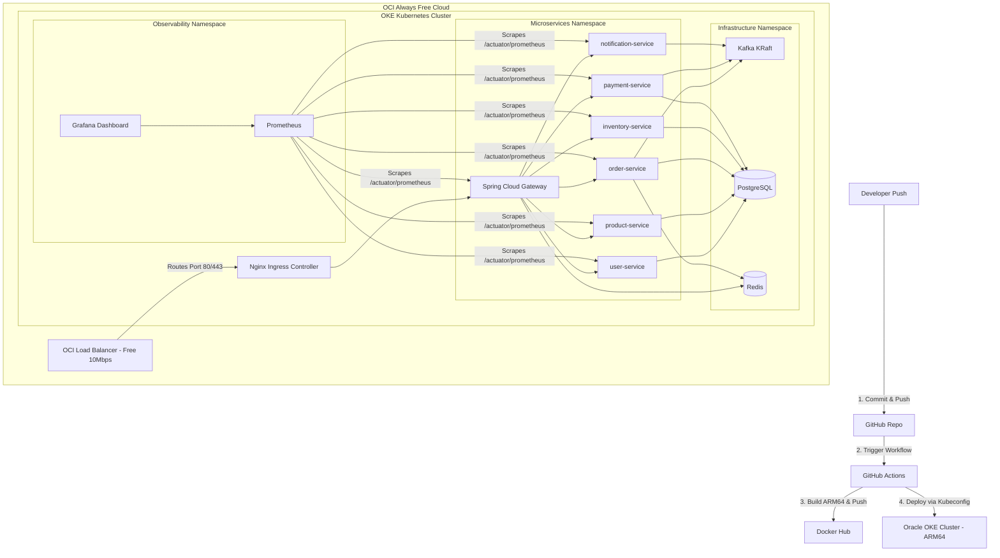

# Guide: Deploying Microservices on Oracle Cloud Always Free OKE (Managed Kubernetes)

Deploying your microservices stack on **Oracle Container Engine for Kubernetes (OKE)** using OCI's Always Free Tier is a great choice. 

Unlike AWS (which only gives 1GB RAM on Free Tier), Oracle Cloud gives you up to **4 Ampere A1 OCPUs and 24 GB of RAM** for free. This is more than enough memory to run your 9 Spring Boot microservices, databases, messaging brokers, and monitoring stack comfortably.

However, since Oracle's free tier runs on **Ampere A1 (ARM64) processors**, you must build your Docker images for the **ARM64** architecture.

---

## The Architecture Flow on OKE



---

## Table of Contents
1. [The OCI Always Free Resource Advantage](#the-oci-always-free-resource-advantage)
2. [Step 1: Setting up OKE on Oracle Cloud](#step-1-setting-up-oke-on-oracle-cloud)
3. [Step 2: Connecting Locally via OCI CLI & kubectl](#step-2-connecting-locally-via-oci-cli--kubectl)
4. [Step 3: Creating Kubernetes Namespace and ConfigMaps](#step-3-creating-kubernetes-namespace-and-configmaps)
5. [Step 4: Deploying Databases & Kafka (Postgres, Redis, Kafka)](#step-4-deploying-databases--kafka-postgres-redis-kafka)
6. [Step 5: Building ARM64 Images via GitHub Actions (CI/CD)](#step-5-building-arm64-images-via-github-actions-cicd)
7. [Step 6: Deploying Microservices & Gateway](#step-6-deploying-microservices--gateway)
8. [Step 7: Routing External Traffic with Ingress](#step-7-routing-external-traffic-with-ingress)
9. [Step 8: Setting up Prometheus & Grafana Observability](#step-8-setting-up-prometheus--grafana-observability)

---

## The OCI Always Free Resource Advantage

Oracle Cloud Infrastructure (OCI) provides the most generous free tier in the industry:
* **Compute:** 4 Ampere A1 OCPUs and **24 GB RAM** (can be split into up to 4 virtual machines, or pooled together into 1 cluster).
* **Managed Kubernetes (OKE):** The control plane is free, and you can assign your free Ampere A1 resources as worker nodes.
* **Storage:** 200 GB of Block Storage (used for database persistent volumes).
* **Load Balancer:** One Always Free flexible load balancer (up to 10 Mbps bandwidth).

Because you have 24 GB of RAM, you don't need to struggle with extreme RAM starvation! You can safely run all containers with comfortable limits.

---

## Step 1: Setting up OKE on Oracle Cloud

### 1.1 Sign up for OCI
1. Go to [oracle.com/cloud/free/](https://www.oracle.com/cloud/free/) and sign up.
2. Select a **Home Region** where Ampere A1 resources are available (e.g., `us-ashburn-1`, `us-phoenix-1`, or `eu-frankfurt-1`).

### 1.2 Create the OKE Cluster
1. Log in to the **OCI Console**.
2. Open the navigation menu (top-left) and go to **Developer Services** -> **Kubernetes Clusters (OKE)**.
3. Click **Create Cluster**.
4. Choose **Quick Create** (this automatically sets up the required Network VCN, subnets, internet gateway, and NAT gateway) and click **Submit**.
5. Configure Cluster Settings:
   - **Name**: `ecomm-oke-cluster`
   - **Kubernetes Version**: Select the latest default version.
   - **Visibility**: **Public Endpoint** (makes it easier to connect your local machine and GitHub Actions).
6. Configure Worker Node Pool:
   - **Node Type**: Managed
   - **Shape**: Select **VM.Standard.A1.Flex** (Ampere ARM64).
   - **OCPUs**: `2` (or `4` if you want to use your entire free limit).
   - **Memory**: `12` GB (or `24` GB).
   - **Number of Nodes**: `1` (or `2` if using 2 OCPUs/12GB per node).
7. Click **Next** -> **Create Cluster**.
8. OKE will take about 5–10 minutes to provision the cluster, networks, and nodes.

---

## Step 2: Connecting Locally via OCI CLI & kubectl

To manage your OKE cluster, you will interact with it using `kubectl` from your local machine.

### 2.1 Install OCI CLI & kubectl
1. On your Windows machine, open PowerShell as Administrator and run the OCI installer:
   ```powershell
   powershell -ExecutionPolicy Bypass -File ((New-Object System.Net.WebClient).DownloadString('https://raw.githubusercontent.com/oracle/oci-cli/master/scripts/install/install.ps1'))
   ```
2. Install `kubectl` via chocolatey (`choco install kubernetes-cli`) or download the [Windows kubectl binary](https://kubernetes.io/docs/tasks/tools/install-kubectl-windows/).

### 2.2 Configure Local OCI Authentication
1. Run OCI CLI setup in your command prompt:
   ```bash
   oci setup config
   ```
2. Follow the prompts. It will generate an API signing key.
3. Log into OCI Console, click on your User Profile icon (top-right) -> **User Settings** -> **API Keys** -> **Add API Key**.
4. Paste/upload the public key file (`oci_api_key_public.pem`) generated by the CLI. OCI will show a config file snippet. Copy it and update your local `~/.oci/config` file.

### 2.3 Generate your Kubeconfig File
In OCI Console, go to your Cluster page (`ecomm-oke-cluster`) and click **Access Cluster**.
Copy and run the command shown. It looks like:
```bash
oci ce cluster create-kubeconfig --cluster-id <your-cluster-id> --file ~/.kube/config --region <your-region> --token-version 2.0.0
```
Verify the connection to your OKE cluster:
```bash
kubectl get nodes
```
*(You should see your Ampere node listed and in the `Ready` status).*

---

## Step 3: Creating Kubernetes Namespace and ConfigMaps

Create a folder on your local machine called `k8s-manifests` to store all configurations.

### 3.1 Namespace Manifest (`namespace.yaml`)
```yaml
apiVersion: v1
kind: Namespace
metadata:
  name: ecomm
```
Apply it:
```bash
kubectl apply -f namespace.yaml
```

### 3.2 Configurations ConfigMap (`configmap.yaml`)
Since we are using OKE and have 24GB of RAM, we still bypass Eureka and Config Server because it is a **Kubernetes Best Practice** (it makes our deployments much faster and cloud-native).
Create `configmap.yaml`:
```yaml
apiVersion: v1
kind: ConfigMap
metadata:
  name: ecomm-config
  namespace: ecomm
data:
  # Database configuration
  SPRING_DATASOURCE_URL: "jdbc:postgresql://postgres-service:5432/postgres"
  SPRING_DATASOURCE_USERNAME: "postgres"
  SPRING_DATASOURCE_PASSWORD: "secret"
  
  # Redis configuration
  SPRING_DATA_REDIS_HOST: "redis-service"
  SPRING_DATA_REDIS_PORT: "6379"
  
  # Kafka Configuration
  SPRING_KAFKA_BOOTSTRAP_SERVERS: "kafka-service:9092"
  
  # Gateway config & routes
  JWT_SECRET: "qHaRsJX5t4bndubo4eH5LZbVIjzn5lpQRHqvrEZuLhBdY4L5"
  
  # Feign Clients config (points to K8s DNS URLs)
  SPRING_CLOUD_OPENFEIGN_CLIENT_CONFIG_PRODUCT_SERVICE_URL: "http://product-service:8081"
  SPRING_CLOUD_OPENFEIGN_CLIENT_CONFIG_INVENTORY_SERVICE_URL: "http://inventory-service:8083"
  
  # JVM Options - We can set generous memory limits on OKE!
  JAVA_TOOL_OPTIONS: "-Xms128m -Xmx512m -XX:+UseG1GC"
```
Apply it:
```bash
kubectl apply -f configmap.yaml
```

---

## Step 4: Deploying Databases & Kafka (Postgres, Redis, Kafka)

OCI gives us fast Block Volumes to persist PostgreSQL data. When we create a `PersistentVolumeClaim` (PVC) in OKE, OCI automatically provisions a block volume for us!

### 4.1 PostgreSQL with Persistence (`postgres.yaml`)
```yaml
apiVersion: v1
kind: PersistentVolumeClaim
metadata:
  name: postgres-pvc
  namespace: ecomm
spec:
  accessModes:
    - ReadWriteOnce
  resources:
    requests:
      storage: 10Gi # OCI will provision a 10GB block volume
---
apiVersion: apps/v1
kind: Deployment
metadata:
  name: postgres
  namespace: ecomm
spec:
  replicas: 1
  selector:
    matchLabels:
      app: postgres
  template:
    metadata:
      labels:
        app: postgres
    spec:
      containers:
      - name: postgres
        image: postgres:16-alpine
        env:
        - name: POSTGRES_DB
          value: "postgres"
        - name: POSTGRES_USER
          value: "postgres"
        - name: POSTGRES_PASSWORD
          value: "secret"
        ports:
        - containerPort: 5432
        volumeMounts:
        - name: postgres-storage
          mountPath: /var/lib/postgresql/data
        resources:
          limits:
            memory: "512Mi"
            cpu: "1.0"
          requests:
            memory: "256Mi"
            cpu: "0.2"
      volumes:
      - name: postgres-storage
        persistentVolumeClaim:
          claimName: postgres-pvc
---
apiVersion: v1
kind: Service
metadata:
  name: postgres-service
  namespace: ecomm
spec:
  ports:
  - port: 5432
    targetPort: 5432
  selector:
    app: postgres
```

### 4.2 Redis (`redis.yaml`)
```yaml
apiVersion: apps/v1
kind: Deployment
metadata:
  name: redis
  namespace: ecomm
spec:
  replicas: 1
  selector:
    matchLabels:
      app: redis
  template:
    metadata:
      labels:
        app: redis
    spec:
      containers:
      - name: redis
        image: redis:7-alpine
        ports:
        - containerPort: 6379
        resources:
          limits:
            memory: "128Mi"
            cpu: "0.2"
          requests:
            memory: "64Mi"
            cpu: "0.05"
---
apiVersion: v1
kind: Service
metadata:
  name: redis-service
  namespace: ecomm
spec:
  ports:
  - port: 6379
    targetPort: 6379
  selector:
    app: redis
```

### 4.3 Kafka (KRaft Mode - `kafka.yaml`)
```yaml
apiVersion: apps/v1
kind: Deployment
metadata:
  name: kafka
  namespace: ecomm
spec:
  replicas: 1
  selector:
    matchLabels:
      app: kafka
  template:
    metadata:
      labels:
        app: kafka
    spec:
      containers:
      - name: kafka
        image: apache/kafka:3.7.0
        ports:
        - containerPort: 9092
        env:
        - name: KAFKA_NODE_ID
          value: "1"
        - name: KAFKA_PROCESS_ROLES
          value: "broker,controller"
        - name: KAFKA_LISTENERS
          value: "PLAINTEXT://0.0.0.0:9092,CONTROLLER://0.0.0.0:9093"
        - name: KAFKA_ADVERTISED_LISTENERS
          value: "PLAINTEXT://kafka-service:9092"
        - name: KAFKA_CONTROLLER_LISTENER_NAMES
          value: "CONTROLLER"
        - name: KAFKA_LISTENER_SECURITY_PROTOCOL_MAP
          value: "CONTROLLER:PLAINTEXT,PLAINTEXT:PLAINTEXT"
        - name: KAFKA_CONTROLLER_QUORUM_VOTERS
          value: "1@localhost:9093"
        - name: KAFKA_OFFSETS_TOPIC_REPLICATION_FACTOR
          value: "1"
        - name: KAFKA_TRANSACTION_STATE_LOG_REPLICATION_FACTOR
          value: "1"
        - name: KAFKA_TRANSACTION_STATE_LOG_MIN_ISR
          value: "1"
        - name: KAFKA_LOG_DIRS
          value: "/tmp/kraft-combined-logs"
        - name: CLUSTER_ID
          value: "MkU3OEVBNTcwNTJENDM2Qk"
        - name: KAFKA_JVM_PERFORMANCE_OPTS
          value: "-Xms128m -Xmx256m"
        resources:
          limits:
            memory: "512Mi"
            cpu: "0.5"
          requests:
            memory: "256Mi"
            cpu: "0.1"
---
apiVersion: v1
kind: Service
metadata:
  name: kafka-service
  namespace: ecomm
spec:
  ports:
  - port: 9092
    targetPort: 9092
  selector:
    app: kafka
```

Apply all infrastructure manifests:
```bash
kubectl apply -f postgres.yaml
kubectl apply -f redis.yaml
kubectl apply -f kafka.yaml
```

---

## Step 5: Building ARM64 Images via GitHub Actions (CI/CD)

Because Oracle's free tier uses **ARM64** worker nodes, you **must build your Docker images for ARM64**. If you try to run standard x86/AMD64 images on your nodes, your pods will crash with `Exec format error` or `CrashLoopBackOff`.

We will configure GitHub Actions to use **Docker Buildx** and **QEMU** to build and package ARM64 container images.

### 5.1 Set up Secrets in GitHub
In your GitHub Repository, go to **Settings** -> **Secrets and variables** -> **Actions** -> **New repository secret** and add:
- `DOCKERHUB_USERNAME`: Your Docker Hub username.
- `DOCKERHUB_TOKEN`: A Docker Hub Access Token.
- `KUBECONFIG_CONTENT`: The contents of your local `~/.kube/config` file. (This allows GitHub Actions to authenticate with your OKE cluster directly).

### 5.2 Write GitHub Actions Workflow (`.github/workflows/deploy.yml`)
Create a workflow file in your project:

```yaml
name: CI/CD Pipeline to Oracle OKE

on:
  push:
    branches: [ main ]

jobs:
  build-and-push:
    runs-on: ubuntu-latest
    strategy:
      matrix:
        service: [
          'product_service', 
          'order-service', 
          'inventory-service', 
          'user-service', 
          'notification-service', 
          'payment_service',
          'api-gateway'
        ]
    steps:
    - name: Checkout Code
      uses: actions/checkout@v4

    - name: Set up JDK 17
      uses: actions/setup-java@v3
      with:
        java-version: '17'
        distribution: 'temurin'
        cache: 'maven'

    - name: Build Jar File
      run: |
        cd ${{ matrix.service }}
        mvn clean package -DskipTests

    # Set up QEMU for multi-architecture builds (crucial for ARM64 compilation)
    - name: Set up QEMU
      uses: docker/setup-qemu-action@v2

    - name: Set up Docker Buildx
      uses: docker/setup-buildx-action@v2

    - name: Log in to Docker Hub
      uses: docker/login-action@v2
      with:
        username: ${{ secrets.DOCKERHUB_USERNAME }}
        password: ${{ secrets.DOCKERHUB_TOKEN }}

    - name: Build and Push ARM64 Docker Image
      uses: docker/build-push-action@v4
      with:
        context: ./${{ matrix.service }}
        platforms: linux/arm64 # Target Oracle OKE ARM64 Architecture
        push: true
        tags: ${{ secrets.DOCKERHUB_USERNAME }}/ecomm-${{ matrix.service }}:latest

  deploy:
    runs-on: ubuntu-latest
    needs: build-and-push
    steps:
    - name: Checkout Code
      uses: actions/checkout@v4

    - name: Set up Kubeconfig
      run: |
        mkdir -p ~/.kube
        echo "${{ secrets.KUBECONFIG_CONTENT }}" > ~/.kube/config

    - name: Deploy Manifests and Rollout Restart
      run: |
        # Apply updated deployments (if files changed)
        kubectl apply -f k8s-manifests/
        
        # Force Kubernetes to pull the new 'latest' images
        kubectl rollout restart deployment -n ecomm
```

---

## Step 6: Deploying Microservices & Gateway

Here is the template for the **product-service** deployment on OKE. Create `k8s-manifests/product-service.yaml`:

```yaml
apiVersion: apps/v1
kind: Deployment
metadata:
  name: product-service
  namespace: ecomm
spec:
  replicas: 1
  selector:
    matchLabels:
      app: product-service
  template:
    metadata:
      labels:
        app: product-service
    spec:
      containers:
      - name: product-service
        # REPLACE with your Docker Hub username
        image: yourdockerhubuser/ecomm-product-service:latest
        ports:
        - containerPort: 8081
        envFrom:
        - configMapRef:
            name: ecomm-config
        resources:
          limits:
            memory: "512Mi"
            cpu: "0.5"
          requests:
            memory: "256Mi"
            cpu: "0.1"
---
apiVersion: v1
kind: Service
metadata:
  name: product-service
  namespace: ecomm
spec:
  ports:
  - port: 8081
    targetPort: 8081
  selector:
    app: product-service
```

> [!NOTE]
> You will duplicate this template for all other microservices (`user-service`, `order-service`, `inventory-service`, `payment-service`, `notification-service`, and `api-gateway`), updating the ports, names, and images accordingly.

---

## Step 7: Routing External Traffic with Ingress

On OKE, if we set up the **NGINX Ingress Controller**, Oracle Cloud will automatically provision a **Public Load Balancer** under OCI's Always Free tier to route internet traffic directly into the cluster!

### 7.1 Install NGINX Ingress Controller
Run this command from your local machine (with configured kubectl) to install NGINX Ingress:
```bash
kubectl apply -f https://raw.githubusercontent.com/kubernetes/ingress-nginx/controller-v1.8.2/deploy/static/provider/cloud/deploy.yaml
```
Verify that the ingress controller service gets a **Public IP Address** (this might take 2 minutes as OCI provisions the load balancer):
```bash
kubectl get svc -n ingress-nginx
```
*(Look for the `EXTERNAL-IP` of the `ingress-nginx-controller` service. That is your main public IP!)*

### 7.2 Create the Ingress Rule (`ingress.yaml`)
Create `k8s-manifests/ingress.yaml` to direct all HTTP traffic to the API Gateway:
```yaml
apiVersion: networking.k8s.io/v1
kind: Ingress
metadata:
  name: ecomm-ingress
  namespace: ecomm
  annotations:
    kubernetes.io/ingress.class: "nginx"
    nginx.ingress.kubernetes.io/ssl-redirect: "false"
spec:
  rules:
  - http:
      paths:
      - path: /
        pathType: Prefix
        backend:
          service:
            name: api-gateway
            port:
              number: 8080
```
Apply it:
```bash
kubectl apply -f ingress.yaml
```

Now, your microservices API will be live at:
`http://<YOUR_OCI_LOADBALANCER_EXTERNAL_IP>/api/products`

---

## Step 8: Setting up Prometheus & Grafana Observability

Since OKE gives us plenty of RAM, we can run Prometheus and Grafana with ease.

### 8.1 Prometheus (`prometheus.yaml`)
```yaml
apiVersion: v1
kind: ConfigMap
metadata:
  name: prometheus-server-conf
  namespace: ecomm
data:
  prometheus.yml: |
    global:
      scrape_interval: 15s
    scrape_configs:
      - job_name: 'spring-boot-apps'
        metrics_path: '/actuator/prometheus'
        static_configs:
          - targets:
            - 'product-service:8081'
            - 'order-service:8082'
            - 'inventory-service:8083'
            - 'user-service:8084'
            - 'payment-service:8086'
            - 'api-gateway:8080'
---
apiVersion: apps/v1
kind: Deployment
metadata:
  name: prometheus
  namespace: ecomm
spec:
  replicas: 1
  selector:
    matchLabels:
      app: prometheus
  template:
    metadata:
      labels:
        app: prometheus
    spec:
      containers:
      - name: prometheus
        image: prom/prometheus:v2.45.0
        args:
          - "--config.file=/etc/prometheus/prometheus.yml"
          - "--storage.tsdb.path=/prometheus/"
        ports:
        - containerPort: 9090
        volumeMounts:
        - name: config-volume
          mountPath: /etc/prometheus/
        resources:
          limits:
            memory: "512Mi"
            cpu: "0.5"
          requests:
            memory: "256Mi"
            cpu: "0.1"
      volumes:
      - name: config-volume
        configMap:
          name: prometheus-server-conf
---
apiVersion: v1
kind: Service
metadata:
  name: prometheus-service
  namespace: ecomm
spec:
  ports:
  - port: 9090
    targetPort: 9090
  selector:
    app: prometheus
```

### 8.2 Grafana (`grafana.yaml`)
```yaml
apiVersion: apps/v1
kind: Deployment
metadata:
  name: grafana
  namespace: ecomm
spec:
  replicas: 1
  selector:
    matchLabels:
      app: grafana
  template:
    metadata:
      labels:
        app: grafana
    spec:
      containers:
      - name: grafana
        image: grafana/grafana-oss:10.0.0
        ports:
        - containerPort: 3000
        env:
        - name: GF_SECURITY_ADMIN_PASSWORD
          value: "admin"
        resources:
          limits:
            memory: "512Mi"
            cpu: "0.5"
          requests:
            memory: "256Mi"
            cpu: "0.1"
---
apiVersion: v1
kind: Service
metadata:
  name: grafana-service
  namespace: ecomm
spec:
  ports:
  - port: 3000
    targetPort: 3000
  selector:
    app: grafana
```

### 8.3 Route Grafana via Ingress
To make Grafana accessible from the web, we can add a route to our `ingress.yaml`:
```yaml
apiVersion: networking.k8s.io/v1
kind: Ingress
metadata:
  name: ecomm-ingress
  namespace: ecomm
  annotations:
    kubernetes.io/ingress.class: "nginx"
    nginx.ingress.kubernetes.io/ssl-redirect: "false"
spec:
  rules:
  - http:
      paths:
      - path: /
        pathType: Prefix
        backend:
          service:
            name: api-gateway
            port:
              number: 8080
      # Route /grafana directly to the Grafana Dashboard service
      - path: /grafana
        pathType: Prefix
        backend:
          service:
            name: grafana-service
            port:
              number: 3000
```
Apply the changes:
```bash
kubectl apply -f prometheus.yaml
kubectl apply -f grafana.yaml
kubectl apply -f ingress.yaml
```

Now, go to `http://<YOUR_OCI_LOADBALANCER_EXTERNAL_IP>/grafana` to access your dashboards and connect to `http://prometheus-service:9090`!
